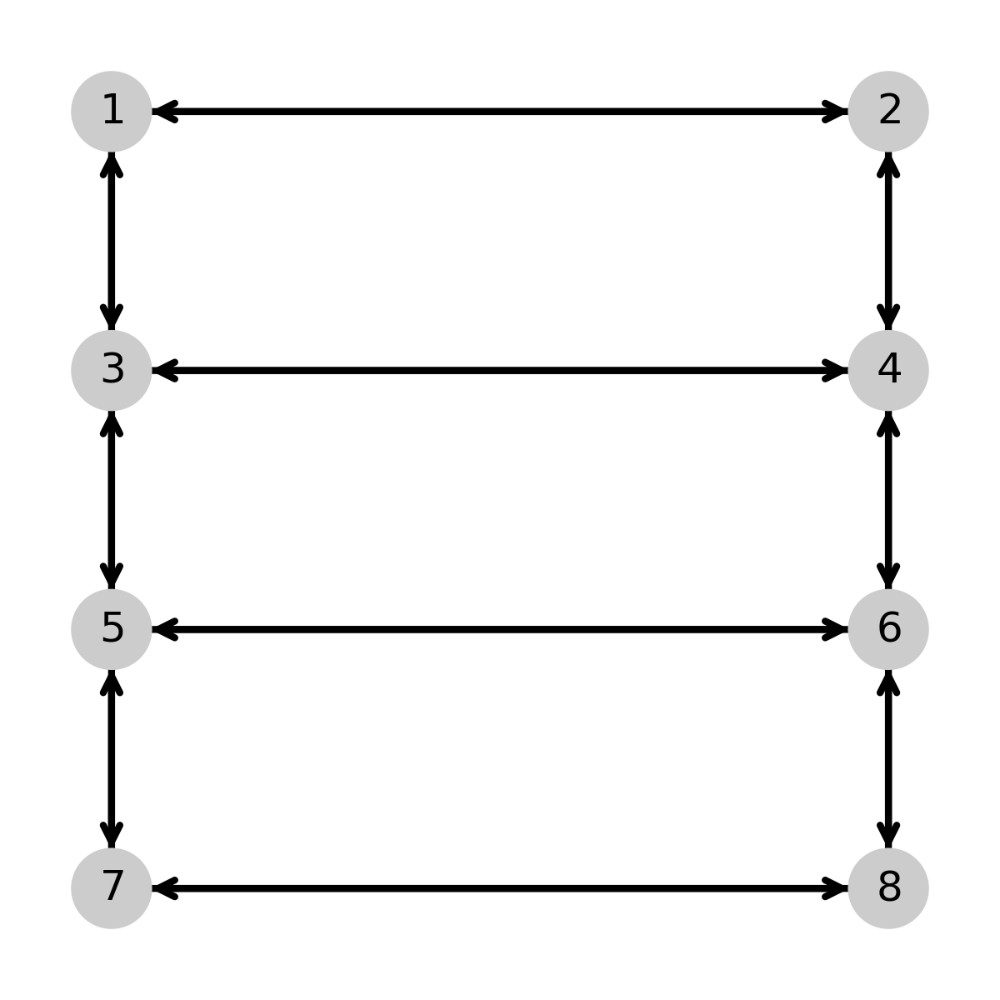

Kinetic Diagram Analysis Examples
====================================
[//]: # (Badges)

[](https://doi.org/10.5281/zenodo.10795714)

Example code for building models using [Kinetic Diagram Analysis](https://github.com/Becksteinlab/kda).

## Examples

 
 
 


## Adding Examples

See [PR #2](https://github.com/Becksteinlab/kda-examples/pull/2) for example on the minimum requirements for adding new examples to the repo.

## Testing

This package has a testing module that checks if the example scripts execute
without error. To run this test, simply install [KDA](https://github.com/Becksteinlab/kda), install
this package (instructions below) and run `pytest`.

## Installation
### Development version from source

To install the latest development version from source, run
```bash
git clone git@github.com:Becksteinlab/kda-examples.git
cd kda-examples
python setup.py install
```

## Copyright

Copyright (c) 2022, Nikolaus Awtrey
