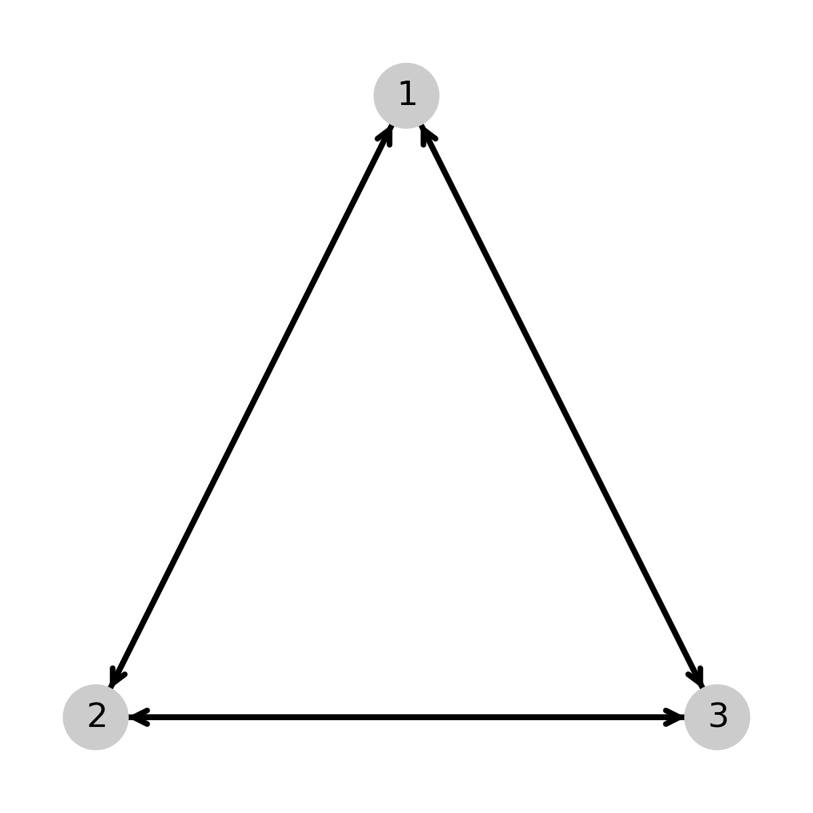
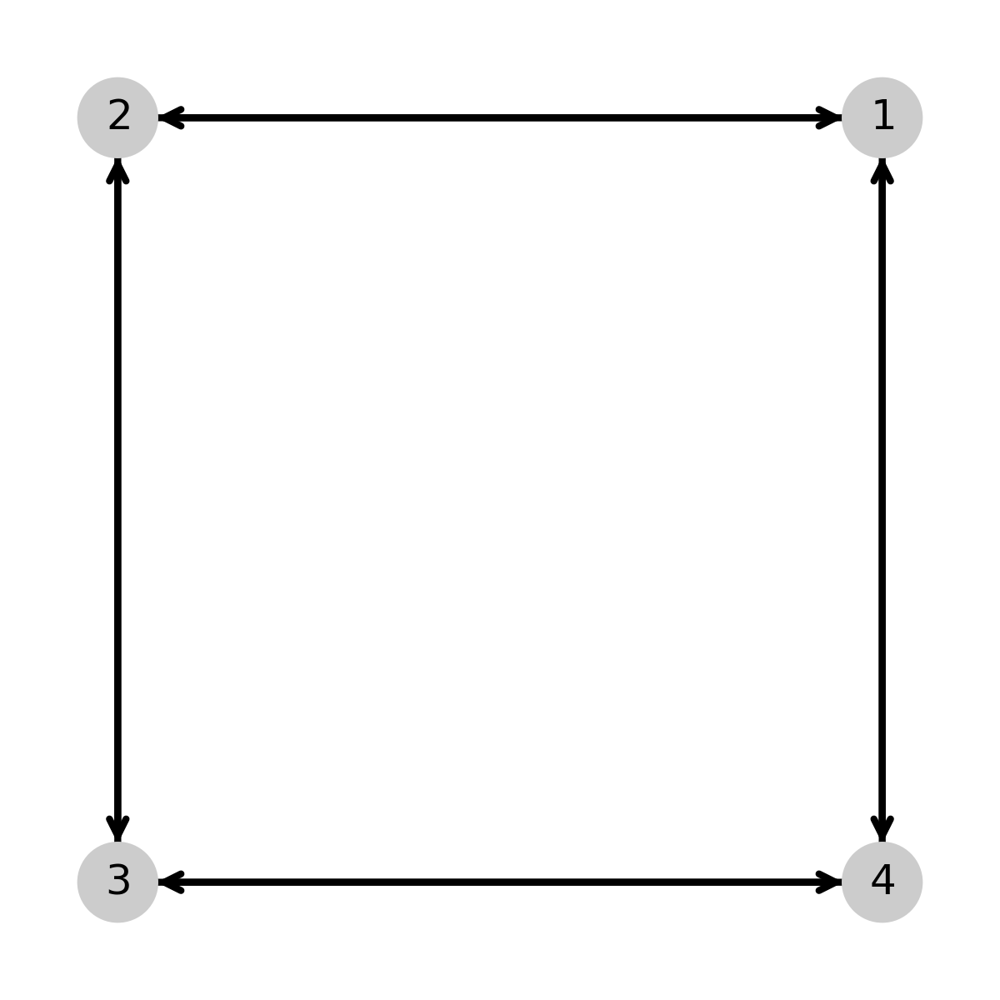
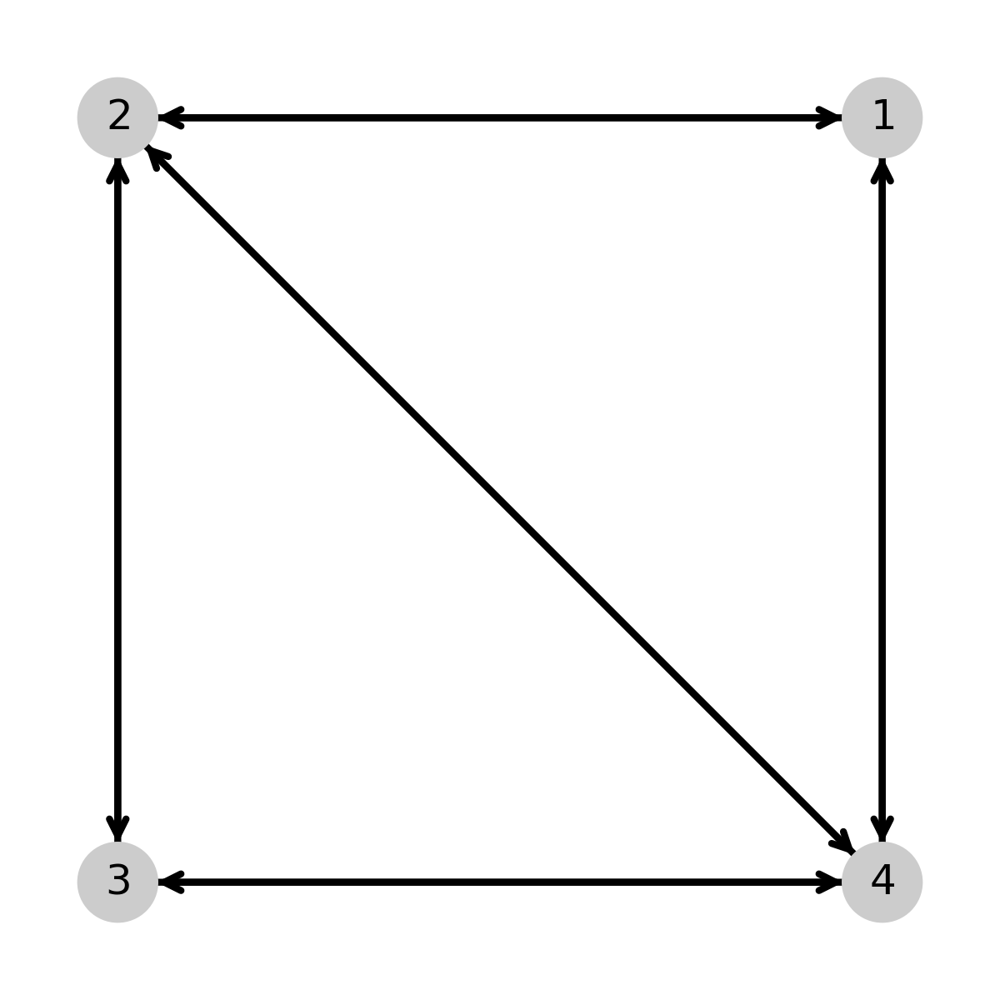
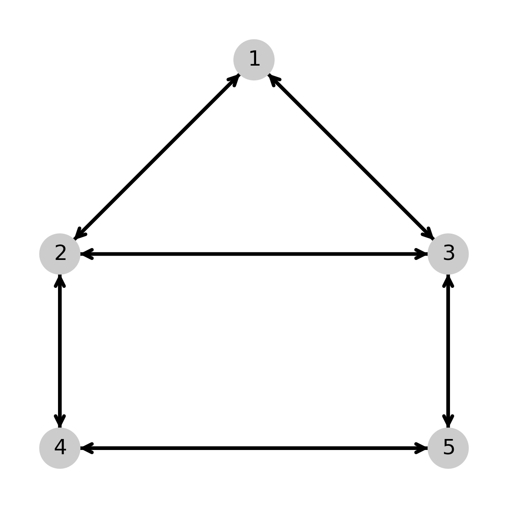
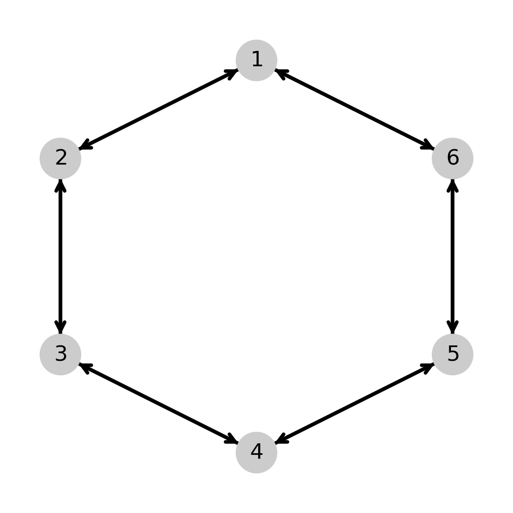
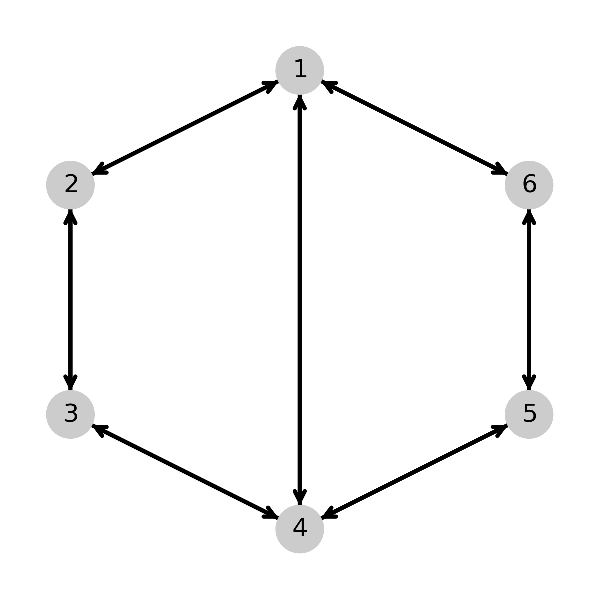

Kinetic Diagram Analysis Examples
====================================

Example code/notebooks for building models using [Kinetic Diagram Analysis](https://github.com/Becksteinlab/kda).

## Examples








## Testing

This package has a testing module that checks if the example scripts execute
without error. To run this test, simply install [KDA](https://github.com/Becksteinlab/kda), install
this package (instructions below) and run `pytest`.

## Installation
### Development version from source

To install the latest development version from source, run
```bash
git clone git@becksteinlab.physics.asu.edu:nawtrey/kda-examples.git
cd kda-examples
python setup.py install
```
